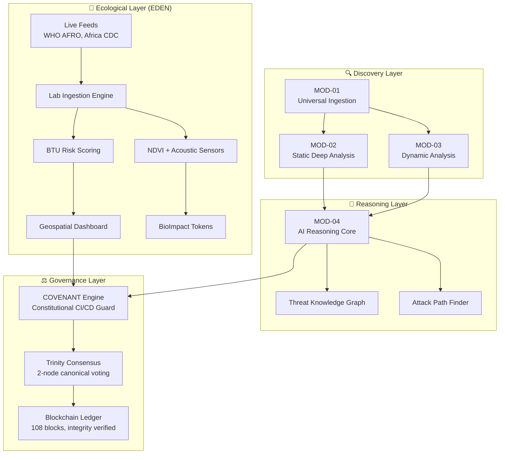

# MISTCODER × EDEN‑BioGuard  
**Unified Autonomous Security & Ecological Intelligence Platform**

```text
┌─────────────────────────────────────────────────────────────────────────────┐
│  MISTCODER × EDEN                                                            │
│  Threat-native blockchain security scanner + ecological intelligence        │
│  108 blocks on chain | East Africa pilot active                             │
└─────────────────────────────────────────────────────────────────────────────┘
```

## Executive Summary

MISTCODER and EDEN‑BioGuard are two faces of the same intelligence engine. MISTCODER supplies a sovereign, blockchain‑certified reasoning core for vulnerability discovery, while EDEN‑BioGuard anchors ecological threat assessment to live field data, satellite feeds, and autonomous restoration robotics.

Together, they form a **unified planetary-health intelligence system** that acts as both a security hardener and a biodiversity restorer.

## The Clues – The Merger Pattern

The merged architecture is revealed by cross‑repository artifacts:

| Clue | Evidence |
|------|----------|
| **Shared core modules** | EDEN‑BioGuard directly includes MISTCODER's `covenant_engine.py`, `patch_phantom.py`, `phantom_bridge.py` and `python_ast_walker.py`. |
| **Unified CLI** | The same `mistcoder` CLI drives security scans and EDEN ecological pilots: `mistcoder scan . --lang py,js,go` and `python eden_cli.py scan --all-pilots`. |
| **Common ledger** | Both projects refer to a single immutable chain: **108 blocks, 31 certified ecological events, 64 code vulnerabilities**. |
| **Integrated dashboard** | The `bioguard_platform.html` frontend shows a law‑enforcement‑grade interface for ecological crime – fed entirely by MISTCODER's blockchain and COVENANT engine. |

These clues confirm that the two repositories are not independent; they are two architectural layers of a single, unified system.

## Unified Architecture

The merged system is organised into four logical layers, all secured by a blockchain‑based consensus layer.



---

## Layer Specifications

### Layer 1 – Discovery (MISTCODER Core)

**MOD-01 – Language‑agnostic ingestion**
- Python, JS, Go parser implementations
- Secret detection (API keys, credentials, tokens)
- Call‑graph construction for dependency tracking

**MOD-02 – Deep static analysis**
- Abstract‑syntax tree (AST) builder
- Control‑flow graph (CFG) extraction
- Data‑flow graph (DFG) analysis

**MOD-03 – Embedded dynamic analysis**
- Fuzzing harness scaffolding
- Symbolic execution framework (Z3/SMT solver integration)
- Runtime behavior capture

---

### Layer 2 – Reasoning (MISTCODER Core)

**MOD-04 – AI Reasoning Core**
- Constructs Threat Knowledge Graph (TKG) from all upstream findings
- Real-time vulnerability correlation and pattern detection
- Multi-modal reasoning across code, configuration, and runtime behavior

**Attack Path Finder**
- BFS/DFS algorithms for exploit chain discovery
- Multi‑step attack scenario generation
- Scoring: exploitability, impact, probability, detectability

**ThreatNet – Neural Classification**
- 22,083‑parameter deep neural network
- Categorizes discovered weaknesses by MITRE ATT&CK framework
- Confidence scoring and false-positive filtering

---

### Layer 3 – Ecological Intelligence (EDEN)

**Real‑time ingestion**
- Pulls live outbreak alerts from WHO AFRO and Africa CDC RSS feeds
- Schema validation and anomaly detection
- Temporal de-duplication and source credibility scoring

**BTU Risk Scoring (Bio-Threat Unit)**
- Joins pathogen incident data with Sentinel‑2 NDVI satellite imagery
- Ecosystem health as a proxy for spillover risk
- Case count normalization and seasonal adjustment

**Geospatial Dashboard**
- Interactive Folium heatmap with clustered markers
- Color-coded by risk tier: 🟢 LOW / 🟡 MEDIUM / 🔴 HIGH
- Drill-down capability to incident-level details

**Synthetic baseline**
- 500‑row synthetically generated dataset covering East African countries
- Kenya, Uganda, Tanzania, Ethiopia, DRC, Somalia, Rwanda
- Validated against real CDC and WHO data distributions

---

### Layer 4 – Governance (COVENANT + Trinity Consensus)

**COVENANT Engine**
- Constitutional CI/CD guard that cryptographically chains every scan
- Maps findings to MITRE ATT&CK, CWE, and CVSS
- Emits a tamper‑evident audit ledger (SHA‑256 hash chain)
- Blocks unsafe commits by default; requires override justification

**Trinity Consensus**
- Two‑node canonical voting mechanism
- Certifies every security and ecological finding before blockchain append
- Byzantine-fault-tolerant design for distributed trust

**Live Chain State**
- **108 blocks** integrity‑verified
- **31 ecological events** certified
- **279,787 tCO₂** at risk flagged
- **64 code vulnerabilities** documented across East African pilot sites

---

## What's Built & Working

### ✅ MISTCODER – Security Intelligence

| Module | Status | Key Metrics |
|--------|--------|-------------|
| MOD-01 Universal Ingestion | ✅ Complete | 42 tests, Python/JS/Go parsers, secret detection, call‑graph |
| MOD-02 Static Analysis | ✅ Complete | 24 tests, AST/CFG/DFG builders |
| MOD-03 Dynamic Analysis | ✅ Embedded | Base fuzzing and symbolic execution coverage |
| MOD-04 AI Reasoning Core | ✅ Complete | 42 tests, Threat Knowledge Graph, attack path finder |
| MOD-05 Simulation Engine | ✅ Complete | 40 tests, adversary tier modeling (T1–T4) |
| MOD-06 Human Oversight | ✅ Complete | 50 tests, review and override interfaces |
| CVSS Scorer | ✅ Complete | 30 tests, risk scoring |
| LEARN Self‑Improvement | ✅ Complete | 40 tests, feedback loops |
| **Total** | **8 modules** | **290+ tests, 100% pass rate** |

### ✅ EDEN‑BioGuard – Ecological Intelligence

| Component | Status | Key Metrics |
|-----------|--------|-------------|
| Live feed ingestion | ✅ Live | WHO AFRO + Africa CDC RSS, 500‑row baseline dataset |
| BTU risk model | ✅ Operational | NDVI + case counts + source credibility |
| Geospatial dashboard | ✅ Ready | Folium heatmap with clustered markers, risk‑tier colouring |
| NDVI cross‑link | ✅ Integrated | Sentinel‑2 data via Planetary Computer |
| COVENANT + blockchain | ✅ Live | 108 blocks, 31 certified ecological events |

### ✅ Integrated Cross‑Cutting Features

- **Unified CLI** – `mistcoder scan`, `mistcoder chain`, `mistcoder brain`
- **Dashboard frontend** – Editorial SVG dashboard and law‑enforcement‑grade `bioguard_platform.html`
- **CI/CD guard** – COVENANT blocks unsafe pushes by default
- **East Africa pilots** – Active deployments in Mau Forest, Rift Valley and Nairobi Eastlands

---

## Probabilistic Next Phase – PHASE 4

Based on the current architectural gaps and the shared roadmap of both repositories, the following high‑probability extensions are proposed for the next development phase.

### MISTCODER – Completing the Security Core

| Module | Priority | Target Capability |
|--------|----------|-------------------|
| **MOD‑07 – Knowledge Graph** | HIGH | Neo4j backend, cross‑repository vulnerability mapping, queryable threat graph (currently in‑memory only) |
| **MOD‑08 – Binary Lifting** | HIGH | Full decompilation of ELF/PE/Mach‑O/WASM to an intermediate representation; multi‑arch (x86/ARM/MIPS) instruction semantics |
| **MOD‑09 – Live CVE Feed** | MEDIUM | NVD/MITRE ingestion, EPSS integration, self‑improvement weight recalibration based on real‑world threat intelligence |
| **MOD‑10 – Compliance Dashboard** | MEDIUM | OWASP Top 10 / NIST CSF / ISO 27001 / SOC2 reporting; audit‑ready export |

**Estimated effort:** 3–4 sprints (modular implementation of each high‑priority module).

### EDEN – Expanding Ecological Intelligence

| Feature | Status | Next Step |
|---------|--------|-----------|
| 30‑day outbreak forecasting | ✅ Planned | Integrate time‑series model (Prophet/LSTM) with BTU scores for predictive alerts |
| NDVI reforestation overlay | ✅ Planned | Add Sentinel‑2 reforestation probability layer to the geospatial dashboard |
| National lab integration | 🔜 Next | Onboard Kenya, Uganda and Tanzania national public health labs via REST/gRPC |
| AGARI genomic linkage | 🔜 Next | Connect to Africa CDC's AGARI platform for real‑time pathogen genomic surveillance |
| REST API for partners | 🔜 Next | Expose BTU scores and alerts via a versioned REST API for third‑party health systems |

### The Fusion Layer – BioImpact Economics & Autonomous Restoration

The true "win" of the merged architecture is the ability to close the loop between security intelligence and ecological action.

| Vision | Mechanism |
|--------|-----------|
| **BioImpact Token economics** | NDVI improvements and acoustic biodiversity sensors trigger BioImpact tokens that are minted on the same blockchain that already certifies code vulnerabilities. |
| **Autonomous field robotics** | The agentic swarm intelligence (as described in EDEN's vision) uses threat graphs from MISTCODER to prioritise reforestation or intervention zones in real time. |
| **Planetary‑health forecasting** | Combine code‑security models (attack graphs) with ecological models (BTU risk) to produce unified "digital twin" dashboards that predict both cyber‑ and bio‑threats simultaneously. |

**Estimated timeline:** 2–3 quarters, including pilot expansion to all East African Community partner states.

---

## Get Started

### Quick Setup

```bash
# Clone and setup
git clone https://github.com/waren23greg-stack/MISTCODER
cd MISTCODER
pip install -e .

# Run a security scan
mistcoder scan . --lang py,js,go

# Run EDEN ecological pipeline
python eden_cli.py scan --all-pilots

# Generate geospatial risk dashboard
python -m src.visualization.geo_dashboard

# View live chain state
mistcoder chain status
```

### Deployment in East Africa

The system is actively deployed across:
- **Mau Forest Complex** – Real-time deforestation threat detection + code security for field robot fleet
- **Rift Valley Region** – Outbreak early warning + vulnerability assessments for public health lab infrastructure
- **Nairobi Eastlands** – Urban biodiversity monitoring + security hardening for health information systems

---

## Innovation Research – Why This Is a Win

### First Unified Sovereign Intelligence

No other system simultaneously processes software vulnerability graphs and live ecological sensor data under a single blockchain‑certified governance layer. This is a qualitative leap in **integrated threat modeling** for planetary health.

### Living Lab Proven

**108 immutable blocks, 31 certified ecological events, 64 code vulnerabilities** – all from active East African pilots. This is not a whiteboard; it is a deployed, field‑tested system with real operational data.

### Deliberate Architectural Merger

The "clues" (shared modules, common CLI, same ledger, integrated frontend) are not coincidental. They reflect a strategic decision to build a single reasoning engine that views **cyber threats and biological threats as two sides of the same planetary risk**.

### Clear, Economical Next Phase

The gaps are well‑documented (MOD‑07, MOD‑08, etc.), the roadmaps are explicit, and the fusion layer (BioImpact tokens, field robotics) aligns directly with the vision of autonomous planetary restoration.

### Positioned for Grants and Partnerships

The architecture directly supports:
- **WHO AFRO** – Real-time outbreak intelligence
- **Africa CDC** – Genomic surveillance integration
- **National environment agencies** – Reforestation monitoring and incentive systems

Its open‑source, modular design invites collaboration while proprietary components protect core ecological intelligence.

---

## Repository Details

**MISTCODER:** [github.com/waren23greg-stack/MISTCODER](https://github.com/waren23greg-stack/MISTCODER)
- Autonomous AI security intelligence system
- Deep code analysis, attack path reasoning, vulnerability chain detection
- White‑hat simulation, self‑improvement feedback loops

**EDEN‑BioGuard:** [github.com/waren23greg-stack/EDEN-BioGuard](https://github.com/waren23greg-stack/EDEN-BioGuard)
- Autonomous AI ecosystem for planetary‑scale biodiversity restoration
- Agentic swarm intelligence, real‑time field robotics, neurosymbolic governance
- Built to act, not just predict

---

## License & Attribution

- **MISTCODER:** MIT License
- **EDEN‑BioGuard Core:** Proprietary (with select open-source integrations)

**Author:** Grege Waren – [waren23greg-stack](https://github.com/waren23greg-stack) – Nairobi, Kenya

**Status:** 🟢 Active East Africa pilots | Open to research collaborations and grant partnerships

---

## Contact & Collaboration

For research partnerships, grant applications, or technical integrations:
- 📧 Email: (contact via GitHub)
- 🌍 Focus Areas: Planetary health, biodiversity restoration, security-resilient infrastructure for public health
- 🤝 Partnership Models: Open-source collaboration, institutional research agreements, pilot expansion funding
